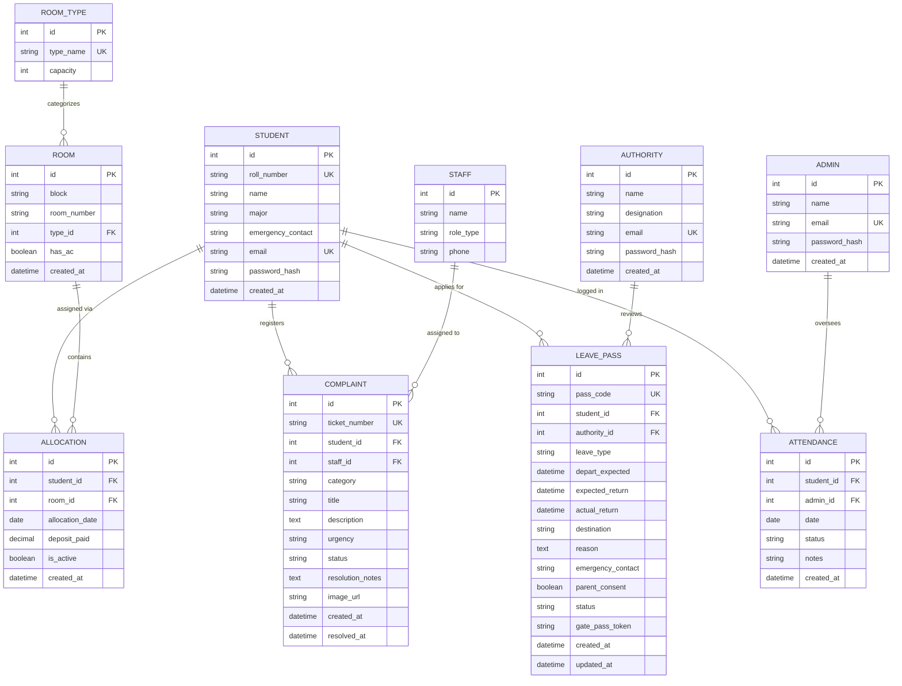

# HostelOS — Hostel Room Allocation & Complaint Management System

**Course**: 23CSE202 — Database Management Systems  
**Academic Group**: Group C9 · Amrita School of Computing, Amrita Vishwa Vidyapeetham  
**Project**: Relational Database-Driven Campus Hostel Management System  
**Stack**: React 18 (Vite, Tailwind CSS, Lucide Icons) + Python FastAPI + SQLAlchemy 2.0 ORM + PostgreSQL / SQLite  

---

## 👥 Group C9 Team Members

| Name | Student Roll Number | Branch | Academic Year |
|---|---|---|---|
| **Siddharth Sai** | `AM.SC.U4CSE25209` | Computer Science & Engineering | 2025–2029 |
| **Gowtham Adithya** | `AM.SC.U4CSE25258` | Computer Science & Engineering | 2025–2029 |
| **Rama Sri Surya** | `AM.SC.U4CSE25263` | Computer Science & Engineering | 2025–2029 |
| **Sai Santhosh** | `AM.SC.U4CSE25264` | Computer Science & Engineering | 2025–2029 |

---

## 📋 Executive Project Abstract

The **Hostel Room Allocation and Complaint Management System (HostelOS)** is an enterprise relational database system engineered to automate hostel operations for residential campuses. Traditional hostel management relies on manual physical registers or fragmented spreadsheets, creating critical operational issues:
- Room overbooking exceeding physical bed capacity.
- Untracked student departure and gate pass return dates.
- Slow turnaround and missing accountability for maintenance complaints.
- Data anomalies due to transitive and partial functional dependencies.

HostelOS solves these challenges through a **10-table relational schema normalized to Boyce-Codd Normal Form (BCNF / 3NF)** with database constraints, automated triggers, relational views, and authentic role-based access control directly linking credentials to normalized database tables.

---

## 🏛️ System Architecture & Entity-Relationship Model



---

## 🗄️ Relational Schema: The 10 Normalized Tables

The relational database strictly implements the schema defined in Section 3.3 of `Copy of 03. DB Design.docx`:

### 1. `students` (Table 1 of 10)
Stores resident student biographical, contact, and academic credentials.
- `id` (INTEGER, Primary Key, Auto-increment)
- `roll_number` (VARCHAR(50), UNIQUE, NOT NULL, Indexed) — e.g. `'AM.SC.U4CSE25209'`
- `name` (VARCHAR(255), NOT NULL)
- `major` (VARCHAR(255), NOT NULL, Default: `'Computer Science & Engineering'`)
- `emergency_contact` (VARCHAR(50), NOT NULL)
- `email` (VARCHAR(255), UNIQUE, NOT NULL, Indexed)
- `password_hash` (VARCHAR(255), NOT NULL) — Salted Bcrypt hash
- `created_at` (TIMESTAMP WITH TIME ZONE, Server Default: `CURRENT_TIMESTAMP`)

### 2. `room_types` (Table 2 of 10)
Extracted from `rooms` to eliminate 3NF transitive dependencies (`type_name -> capacity`).
- `id` (INTEGER, Primary Key, Auto-increment)
- `type_name` (VARCHAR(100), UNIQUE, NOT NULL) — `'Single AC'`, `'Double AC'`, `'Double Non-AC'`
- `capacity` (INTEGER, NOT NULL) — 1 or 2 beds

### 3. `rooms` (Table 3 of 10)
Hostel accommodation units across Blocks A, B, and C.
- `id` (INTEGER, Primary Key, Auto-increment)
- `block` (VARCHAR(50), NOT NULL, Indexed) — `'Block A'`, `'Block B'`, `'Block C'`
- `room_number` (VARCHAR(50), NOT NULL, Indexed) — e.g. `'A-101'`, `'B-202'`
- `type_id` (INTEGER, Foreign Key &rarr; `room_types.id` ON DELETE RESTRICT, NOT NULL)
- `has_ac` (BOOLEAN, Default: `FALSE`, NOT NULL)
- `created_at` (TIMESTAMP WITH TIME ZONE, Server Default: `CURRENT_TIMESTAMP`)
- **Constraint**: `UNIQUE (block, room_number)` ensures unique room identification per hostel block.

### 4. `allocations` (Table 4 of 10)
Junction table tracking bed assignment history and active residency over time.
- `id` (INTEGER, Primary Key, Auto-increment)
- `student_id` (INTEGER, Foreign Key &rarr; `students.id` ON DELETE CASCADE, NOT NULL)
- `room_id` (INTEGER, Foreign Key &rarr; `rooms.id` ON DELETE CASCADE, NOT NULL)
- `allocation_date` (DATE, NOT NULL, Default: `CURRENT_DATE`)
- `deposit_paid` (NUMERIC(10,2), NOT NULL, Default: `5000.00`)
- `is_active` (BOOLEAN, NOT NULL, Default: `TRUE`)
- `created_at` (TIMESTAMP WITH TIME ZONE, Server Default: `CURRENT_TIMESTAMP`)

### 5. `admins` (Table 5 of 10)
College Executive Administration and Institute Heads.
- `id` (INTEGER, Primary Key, Auto-increment)
- `name` (VARCHAR(255), NOT NULL)
- `email` (VARCHAR(255), UNIQUE, NOT NULL, Indexed)
- `password_hash` (VARCHAR(255), NOT NULL)
- `created_at` (TIMESTAMP WITH TIME ZONE, Server Default: `CURRENT_TIMESTAMP`)

### 6. `staff` (Table 6 of 10)
Maintenance technicians and hostel service staff.
- `id` (INTEGER, Primary Key, Auto-increment)
- `name` (VARCHAR(255), NOT NULL) — e.g. `'Murugan'`, `'Ramesh'`
- `role_type` (VARCHAR(100), NOT NULL) — `'Senior Electrician'`, `'Plumber'`, `'Carpenter'`, `'Housekeeping'`
- `phone` (VARCHAR(50), NOT NULL)

### 7. `authorities` (Table 7 of 10)
Hostel Wardens and Approving Authorities.
- `id` (INTEGER, Primary Key, Auto-increment)
- `name` (VARCHAR(255), NOT NULL) — e.g. `'Dr. Suresh Kumar'`
- `designation` (VARCHAR(100), NOT NULL, Default: `'Chief Warden'`)
- `email` (VARCHAR(255), UNIQUE, NOT NULL, Indexed)
- `password_hash` (VARCHAR(255), NOT NULL)
- `created_at` (TIMESTAMP WITH TIME ZONE, Server Default: `CURRENT_TIMESTAMP`)

### 8. `complaints` (Table 8 of 10)
Infrastructure maintenance tickets with staff assignment.
- `id` (INTEGER, Primary Key, Auto-increment)
- `ticket_number` (VARCHAR(50), UNIQUE, NOT NULL, Indexed) — Format: `'CM-2026-XXXX'`
- `student_id` (INTEGER, Foreign Key &rarr; `students.id` ON DELETE CASCADE, NOT NULL)
- `staff_id` (INTEGER, Foreign Key &rarr; `staff.id` ON DELETE SET NULL)
- `category` (VARCHAR(100), NOT NULL, Indexed) — `'Plumbing'`, `'Electrical & Lighting'`, `'Internet Connectivity'`, `'Carpentry / Furniture'`, `'Housekeeping'`
- `title` (VARCHAR(200), NOT NULL)
- `description` (TEXT, NOT NULL)
- `urgency` (VARCHAR(20), NOT NULL, Default: `'Medium'`) — `'High'`, `'Medium'`, `'Low'`
- `status` (VARCHAR(50), NOT NULL, Default: `'Open'`, Indexed) — `'Open'`, `'Escalated'`, `'Resolved'`
- `assigned_staff` (VARCHAR(255), Optional)
- `resolution_notes` (TEXT, Optional)
- `image_url` (VARCHAR(500), Optional)
- `created_at` (TIMESTAMP WITH TIME ZONE, Server Default: `CURRENT_TIMESTAMP`)
- `resolved_at` (TIMESTAMP WITH TIME ZONE, Optional, populated upon resolution)

### 9. `attendance` (Table 9 of 10)
Daily night roll-call register.
- `id` (INTEGER, Primary Key, Auto-increment)
- `student_id` (INTEGER, Foreign Key &rarr; `students.id` ON DELETE CASCADE, NOT NULL)
- `admin_id` (INTEGER, Foreign Key &rarr; `admins.id` ON DELETE SET NULL)
- `date` (DATE, NOT NULL, Indexed)
- `status` (VARCHAR(50), NOT NULL, Default: `'Present'`) — `'Present'`, `'Absent'`, `'Late / Permitted'`
- `notes` (VARCHAR(255), Optional)
- `created_at` (TIMESTAMP WITH TIME ZONE, Server Default: `CURRENT_TIMESTAMP`)
- **Constraint**: `UNIQUE (student_id, date)` enforces idempotency (single attendance record per resident per night).

### 10. `leave_passes` (Table 10 of 10)
Out-station gate pass permissions and security verification tokens.
- `id` (INTEGER, Primary Key, Auto-increment)
- `pass_code` (VARCHAR(50), UNIQUE, NOT NULL, Indexed) — Format: `'GP-2026-XXXX'`
- `student_id` (INTEGER, Foreign Key &rarr; `students.id` ON DELETE CASCADE, NOT NULL)
- `authority_id` (INTEGER, Foreign Key &rarr; `authorities.id` ON DELETE SET NULL)
- `leave_type` (VARCHAR(50), NOT NULL) — `'Weekend outing'`, `'Emergency leave'`, `'Vacation'`
- `depart_expected` (TIMESTAMP, NOT NULL)
- `expected_return` (TIMESTAMP, NOT NULL)
- `actual_return` (TIMESTAMP, Optional)
- `destination` (VARCHAR(255), NOT NULL)
- `reason` (TEXT, NOT NULL)
- `emergency_contact` (VARCHAR(50), NOT NULL)
- `parent_consent` (BOOLEAN, NOT NULL, Default: `TRUE`)
- `status` (VARCHAR(50), NOT NULL, Default: `'Pending'`, Indexed) — `'Pending'`, `'Approved'`, `'Validated'`, `'Rejected'`, `'Checked Out'`, `'Returned'`
- `rejection_reason` (TEXT, Optional)
- `gate_pass_token` (VARCHAR(100), Optional) — Cryptographic security authorization token
- `created_at` (TIMESTAMP WITH TIME ZONE, Server Default: `CURRENT_TIMESTAMP`)
- `updated_at` (TIMESTAMP WITH TIME ZONE, Server Default: `CURRENT_TIMESTAMP`)
- **Constraint**: `CHECK (expected_return >= depart_expected)` prevents invalid date ranges.

---

## 📐 Normalization Analysis (BCNF / 3NF)

1. **First Normal Form (1NF)**:
   - All attributes contain only atomic values.
   - Every relation possesses a declared Primary Key.
   - Repeating groups (e.g. bed dot arrays, multi-student rooms) are structured via distinct tuples in junction entity `allocations`.

2. **Second Normal Form (2NF)**:
   - Every non-prime attribute is fully functionally dependent on the entire primary key.
   - In composite/junction tables like `allocations` and `attendance`, no partial dependency exists.

3. **Third Normal Form (3NF)**:
   - Eliminates transitive functional dependencies:
     - In `rooms`, room type capacity (`room_types.capacity`) depends on `type_name`, not `rooms.id`. Splitting `room_types` prevents update anomalies when capacity rules change.
     - In `complaints`, technician phone numbers are decoupled into table `staff`.

4. **Boyce-Codd Normal Form (BCNF)**:
   - For every non-trivial functional dependency $X \rightarrow Y$, the determinant $X$ is a superkey.
   - `students(email) -> students(id)` and `students(roll_number) -> students(id)` hold unique candidate key indexes.

---

## ⚡ Database Constraints & Triggers (PL/pgSQL)

Located in `backend/database/schema_10_tables.sql`:

1. **Trigger: `trg_check_bed_capacity`**:
   - **Timing**: `BEFORE INSERT OR UPDATE ON allocations`
   - **Function**: Counts active occupants for the destination room. If `COUNT >= room_types.capacity`, raises exception: `Room capacity exceeded for room_id ...`.
2. **Constraint & Trigger: `trg_check_leave_dates`**:
   - **Timing**: `BEFORE INSERT OR UPDATE ON leave_passes`
   - **Function**: Enforces `expected_return >= depart_expected`. Throws error if return date is earlier than departure date.
3. **Trigger: `trg_auto_gate_pass_token`**:
   - **Timing**: `BEFORE UPDATE ON leave_passes`
   - **Function**: Automatically generates a unique security verification token (`HOSTEL-PASS-AUTH-XXXX-YYYY`) when warden updates status to `'Approved'`.
4. **Trigger: `trg_auto_resolve_complaint`**:
   - **Timing**: `BEFORE UPDATE ON complaints`
   - **Function**: Automatically sets `resolved_at = CURRENT_TIMESTAMP` whenever a ticket's status transitions to `'Resolved'`.

---

## 🔍 Database Views

1. **`v_room_occupancy_matrix`**:
   Aggregates total beds, active occupants, vacant bed count, and occupancy percentage per room.
2. **`v_student_residence_profile`**:
   Consolidates student academic profiles with currently active room assignment and air-conditioning status.
3. **`v_active_triage_complaints`**:
   Extracts open complaints prioritized by urgency, joining student contact information and assigned technician details.

---

## 🔐 Authentic Role-Based Authentication

Unlike mock role-switchers, authentication is genuinely validated against database records:
- **Institute Head**: Credentials verified against table `admins` via bcrypt. Role: `INSTITUTE_HEAD`.
- **Chief Warden**: Credentials verified against table `authorities` via bcrypt. Role: `WARDEN`.
- **Resident Student**: Credentials verified against table `students` via bcrypt. Role: `STUDENT`.

### Pre-Seeded Evaluation Credentials:

| Academic Role | Name | Campus Email | Password | Authenticated Table |
|---|---|---|---|---|
| **Institute Head** | Prof. K. R. Ramanathan | `admin@hostelos.in` | `Admin@123` | `admins` |
| **Chief Warden** | Dr. Suresh Kumar | `warden@hostelos.in` | `Warden@123` | `authorities` |
| **Resident Student** | Siddharth Verma | `siddharth@hostelos.in` | `Student@123` | `students` (Assigned: A-101) |

---

## 🚀 Local Installation & Execution Guide

### Prerequisites
- Python 3.10+
- Node.js 18+ & npm
- PostgreSQL 14+ (or runs automatically with integrated SQLite)

### 1. Backend Setup

```bash
cd backend

# Create and activate virtual environment
# Windows:
python -m venv venv
.\venv\Scripts\activate

# Linux / macOS:
# python3 -m venv venv
# source venv/bin/activate

# Install Python requirements
pip install -r requirements.txt

# Execute 10-table schema & run live DBMS query verification
python database/test_dbms_queries.py

# Launch FastAPI application server
uvicorn app.main:app --host 0.0.0.0 --port 8000 --reload
```

Backend API Swagger Documentation will be live at:  
👉 **`http://localhost:8000/docs`**

### 2. Frontend React Setup

```bash
cd frontend

# Install npm packages
npm install

# Start development client
npm run dev
```

Frontend application will be live at:  
👉 **`http://localhost:5173`**

### 3. Live DBMS SQL Verification Script (Viva Presentation)

To demonstrate advanced SQL operations live to professors and evaluators:
```bash
cd backend
python database/test_dbms_queries.py
```
This script executes and prints:
1. Multi-table relational joins across 5 tables (`complaints`, `students`, `staff`, `allocations`, `rooms`).
2. Aggregation with `GROUP BY` and `HAVING` computing real-time occupancy percentages.
3. Pattern searches with `LIKE` on roll numbers.
4. Nested subqueries filtering students with high-urgency open tickets.
5. Night attendance roll-call aggregations.
6. REST API authentication verification for each role.

---

## 🌐 Live Cloud Deployment Guide

### Deploying Frontend to Vercel
1. Push repository to GitHub.
2. Link repository in [Vercel Dashboard](https://vercel.com).
3. Set **Root Directory** to `frontend`.
4. Set Build Command: `npm run build` and Output Directory: `dist`.
5. Add Environment Variable:
   - `VITE_API_URL`: Your deployed backend URL (e.g., `https://hostelos-api.onrender.com`).

### Deploying Backend to Render / Railway
1. Create a new **Web Service** on [Render](https://render.com) or [Railway](https://railway.app).
2. Set **Root Directory** to `backend`.
3. Set **Build Command**: `pip install -r requirements.txt`.
4. Set **Start Command**: `uvicorn app.main:app --host 0.0.0.0 --port $PORT`.
5. Attach a managed **PostgreSQL** database and configure `DATABASE_URL`.
